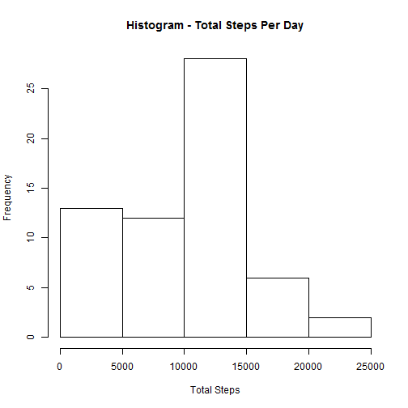
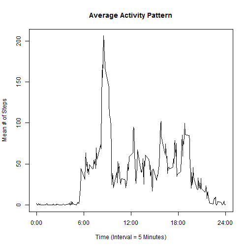
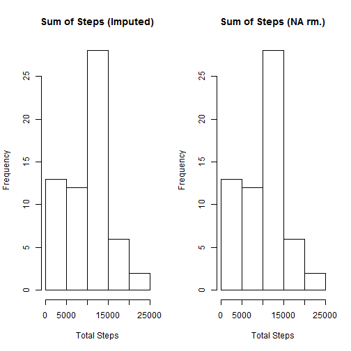
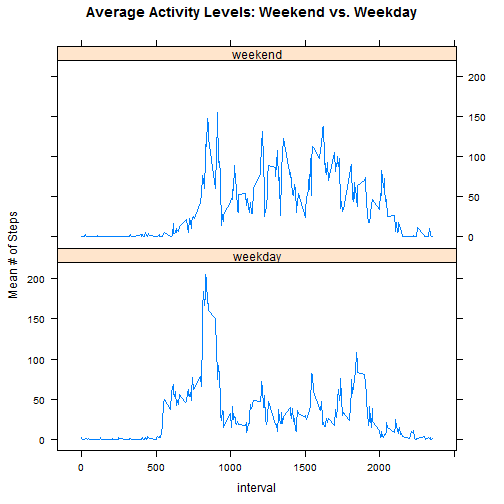

Coursera *Reproducible Research* - Peer Assessment #1
===============================================================================

## Loading and preprocessing the data

First, load the data into memory. As per [Dr. Peng's guidelines](https://github.com/ChristopherJonJensen/RepData_PeerAssessment1/blob/master/README.md), the data is not being downloaded in code, as it is included in the assignment's GitHub repo. I am hiding the output, as it provides no relevant information.

An aside to anyone performing a peer assessment: this is my second time taking this course (as I had to drop due to time constraints last month), so you may notice that some of the files / folders were created a month ago and that there have not been many changes since my initial submission in mid-June. I assure you that this is indeed my original work, it's just that I completed this assignment before dropping.


```r
# Load the data into memory
temp_data <- read.csv("activity.csv")

# transform the date/time fields into R date/time objects, for ease of use
temp_data$date <- as.POSIXct(temp_data$date)
# activity_data$interval <-
# hm(paste(activity_data$interval%/%100,':',activity_data$interval%%100, sep
# = ''))

# use a data-frame (as defined in the 'dplyr' package) to make manipulating
# the data easier)
library("dplyr")
activity_data <- as.data.frame(temp_data)
```

## What is mean total number of steps taken per day?
First, calculate and plot a histogram of the **total** steps taken per day, then report on the median and mean values of this summary data. I have specified 15 breaks, as the histogram defaulted to 5, which did not provide much information. As per assignment guidelines, NA values have been ignored. 

To do this calculation, I employ dplyr's ***summarize*** function to determine the sum of total steps, grouped by day.


```r
temp <- summarize(group_by(activity_data, date), sum(steps, na.rm = TRUE))
names(temp) <- c("date", "sum")
hist(temp$sum, main = "Histogram - Total Steps Per Day", xlab = "Total Steps", 
    breaks = 15)
```

 

Compute the mean value of this output:

```r
mean(temp$sum)
```

```
## [1] 9354.23
```

Compute the median value of this output:

```r
median(temp$sum)
```

```
## [1] 10395
```

##What is the average daily activity pattern?
As above, I employ dplyr's ***summarize*** function to determine the average daily activity pattern, grouping the data by temporal interval and calculating the mean # of steps.


```r
temp <- summarize(group_by(activity_data, interval), mean(steps, na.rm = TRUE))
names(temp) <- c("interval", "mean_steps")

# Plot the data, adding meaningful labels on the x-axis
plot(x = temp$interval, y = temp$mean_steps, type = "l", xaxt = "n", xlab = "Time (Interval = 5 Minutes)", 
    ylab = "Mean # of Steps", main = "Average Activity Pattern")
maxval <- max(temp$interval)
axis(side = 1, at = c(0, maxval/4, maxval/2, (maxval * 3)/4, maxval), labels = c("0:00", 
    "6:00", "12:00", "18:00", "24:00"))
```

 

Determine the interval with the highest average number of steps:

```r
# This code uses the summary statistics calculated above.
temp$interval[temp$mean_steps == max(temp$mean_steps)]
```

```
## [1] 835
```

## Imputing missing values

First, calculate and report the total number of missing values in the dataset.

```r
# Here, I am relying on the fact that R treats logical TRUEs as 1, allowing them to be summed.
sum(is.na(activity_data))
```

```
## [1] 2304
```

To impute values for those that are currently missing, it seems to make sense to base the imputation on the data as subdivided by interval, given that activity levels change predictably over the course of the day. Also, since there are a few odd outlier days (e.g., 2012-10-02, where the subject appears to have taken only 126 steps), it makes sense to base the imputation on the median, as it is less sensitive to outliers.


```r
medians <- summarize(group_by(activity_data, interval), median(steps, na.rm = TRUE))
names(medians) <- c("interval", "median_steps")

imputed_data <- activity_data
for (i in 1:nrow(imputed_data)) {
    if (is.na(imputed_data[i, 1])) {
        # grab the median value for this interval from the *medians* data frame
        # (calculated above)
        cur_median <- medians$median_steps[medians$interval == imputed_data$interval[i]]
        imputed_data[i, 1] <- cur_median
    }
}
```

### Now, to evaluate the effect of removing NA values versus imputing values.


```r
original <- summarize(group_by(activity_data, date), sum(steps, na.rm = TRUE))
imputed <- summarize(group_by(imputed_data, date), sum(steps, na.rm = FALSE))
names(original) <- c("date", "sum")
names(imputed) <- c("date", "sum")
par(mfrow = c(1, 2))
hist(imputed$sum, main = "Sum of Steps (Imputed)", xlab = "Total Steps", breaks = 15)
hist(original$sum, main = "Sum of Steps (NA rm.)", xlab = "Total Steps", breaks = 15)
```

 

Compute the mean value of this output and compare with the initial (NA-removed) values:

```r
mean(imputed$sum)
```

```
## [1] 9503.869
```

```r
mean(original$sum)
```

```
## [1] 9354.23
```

Compute the median value of this output and compare with the initial (NA-removed) values:

```r
median(imputed$sum)
```

```
## [1] 10395
```

```r
median(original$sum)
```

```
## [1] 10395
```

## Are there differences in activity patterns between weekdays and weekends?
Finally, we use the imputed dataset to determine whether there are differences in activity patterns between weekdays and weekends. My initial conversion of the dates in POSIXct format makes this process a little simpler.

Once the "day_type" variable has been calculated for each entry in the imputed dataset, we can then output comparison plots, in order to more easily visualize the differences in activity between weekdays and weekends.


```r
# First, create a little helper function
weekend <- function(x) {
    output <- character(length = length(x))
    for (i in 1:length(x)) {
        if (x[i] == "Saturday" || x[i] == "Sunday") {
            output[i] <- "weekend"
        } else {
            output[i] <- "weekday"
        }
    }
    output
}

# Now determine the day_type for each of the dates in the sample
imputed_data$day_type <- weekend(weekdays(imputed_data$date))

# Calculate the summary stats
temp <- summarize(group_by(imputed_data, interval, day_type), mean(steps, na.rm = TRUE))
names(temp) <- c("interval", "day_type", "mean_steps")

# Now generate the comparison plot, using the lattice package
library(lattice)
xyplot(mean_steps ~ interval | factor(day_type), data = temp, type = "l", layout = (c(1, 
    2)), ylab = "Mean # of Steps", main = "Average Activity Levels: Weekend vs. Weekday")
```

 
